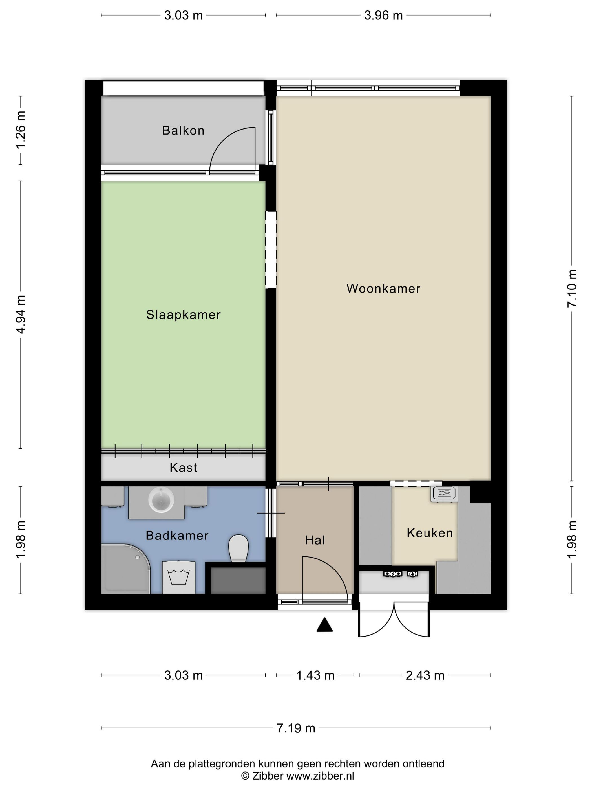
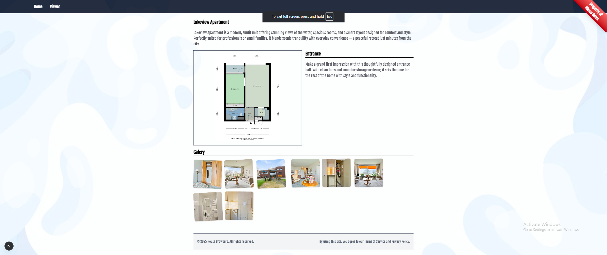
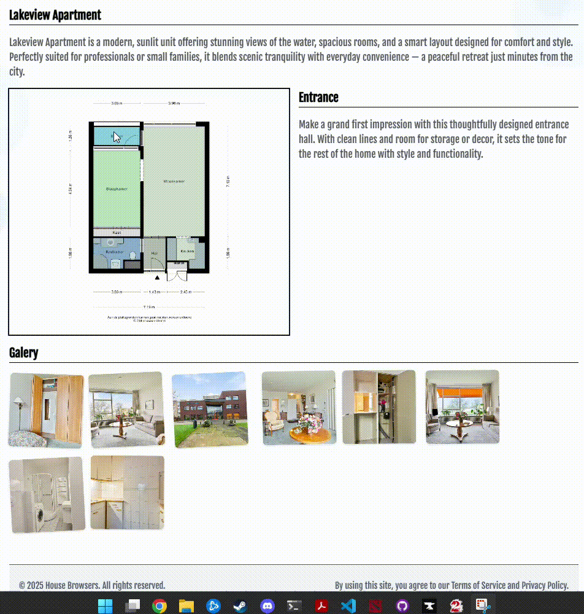

# Project

|  |  |
| --- | --- |
| __Author__ | Marco Botes |
| __Date__ | 7 August 2025 |
| __Tecnologies__ | React, Next.js, Tailwind |
---

## Project Requirement
Develop a property viewing application with a navigation element that allows you to click on each room individually to navigate to different pages.

### Bonus:
Some extra self imposed challenges I wanted to explore
- Execute in Next.js
- Server Side rendering for the pages
- Working API

## Project Execution

After a very small amount of research I came across a library to render complex canvas', [Konva](https://konvajs.org/api/Konva.html). After reading through the documentation the plan was to create an image with an element overlay that accomodates *hover* and *click* events.

  

_Figure 1. The floor plan used for development_

With absolutely no design in mind and very little UI / UX experience - I set off to create a UI that wouldn't keep my up at night.

## Project Result

  

_Figure 2. Desktop View Result_

  

_Figure 3. Navigation Result_

  

_Figure 4. Mobile View Result_
